<div align="center">

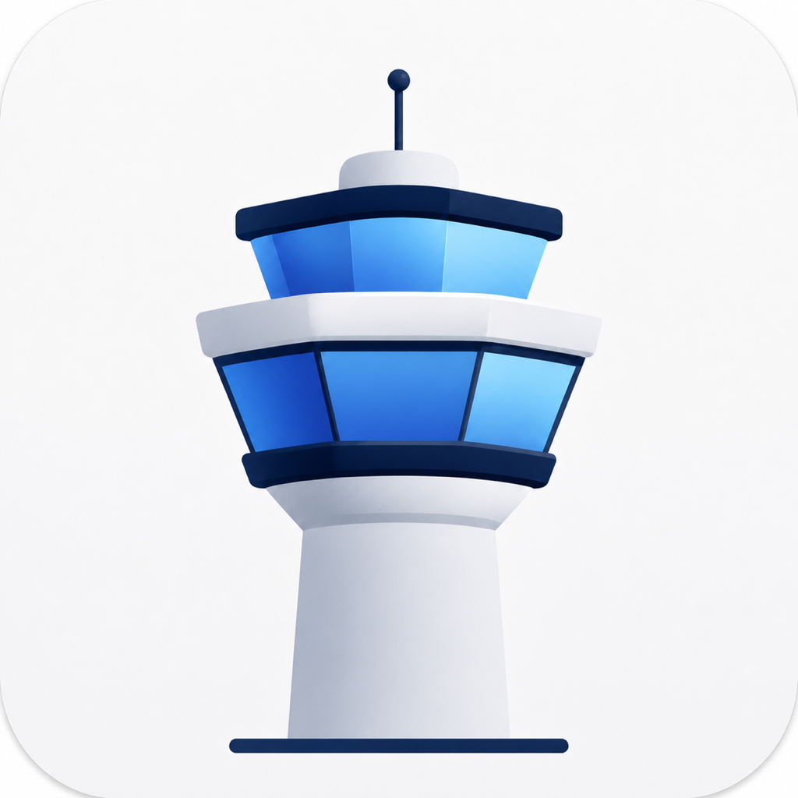

# 塔台 · Tower

**你的订阅，一处打理。**

在 iPhone 和 Mac 上管理订阅与节点，选择规则，生成常用客户端配置。

<a href="https://github.com/pengchujin/tower/releases/download/v1.0.16/Tower-1.0.16-54-macOS-universal.dmg"></a>
&nbsp;
<a href="https://apps.apple.com/app/id6797458927"></a>

[使用指南](https://tower.shenqi.uk) · [更新日志](https://github.com/pengchujin/tower/releases) · [反馈问题](https://github.com/pengchujin/tower/issues)

</div>

Mac 也可以通过 Homebrew 安装：

```sh
brew install --cask pengchujin/tap/tower
```

## 添加订阅 → 选择规则 → 导出使用

<table>
<tr>
<th width="33%">订阅与节点地图</th>
<th width="33%">离线规则与策略组</th>
<th width="33%">导出到常用客户端</th>
</tr>
<tr>
<td>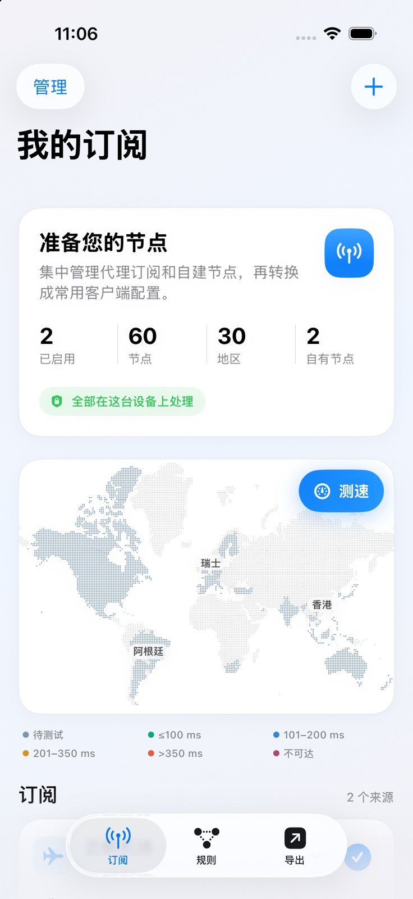</td>
<td>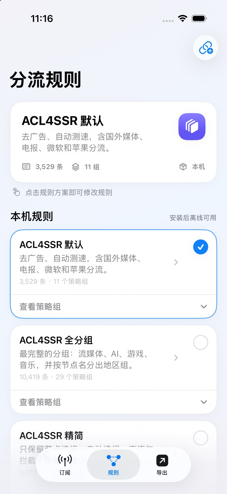</td>
<td>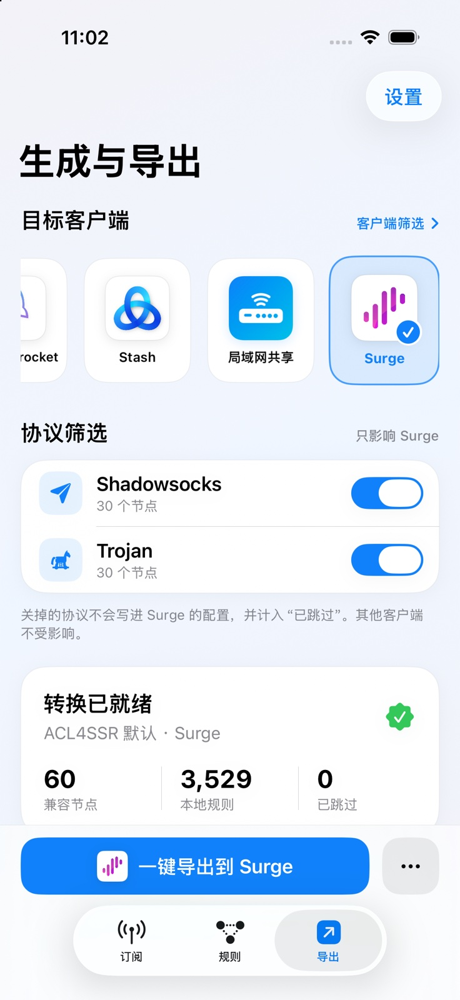</td>
</tr>
</table>

- **集中管理**：订阅、自有节点、流量信息和到期提醒。
- **直观看节点**：离线地区识别、手动标记地区、地图与延迟测试。
- **自由配规则**：内置 ACL4SSR，支持导入规则和定制策略组。
- **跨设备使用**：Mac 专属布局、局域网共享与可选 iCloud 同步。

## 支持你常用的客户端

<p>
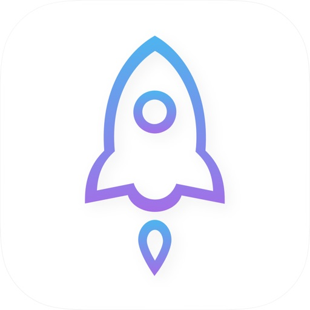&nbsp;
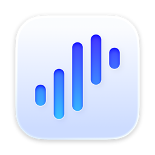&nbsp;
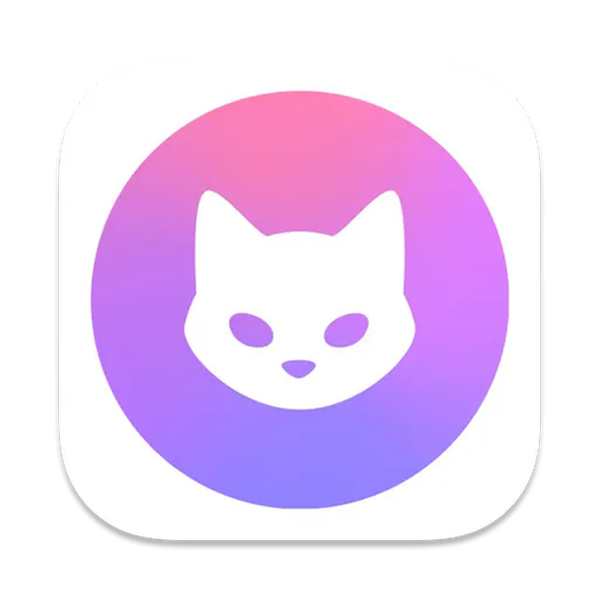&nbsp;
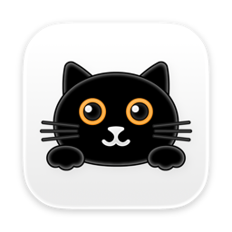&nbsp;
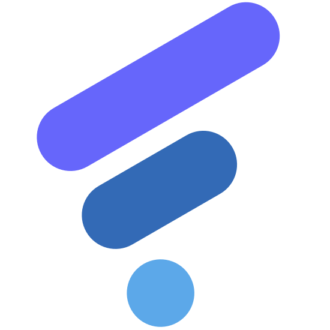&nbsp;
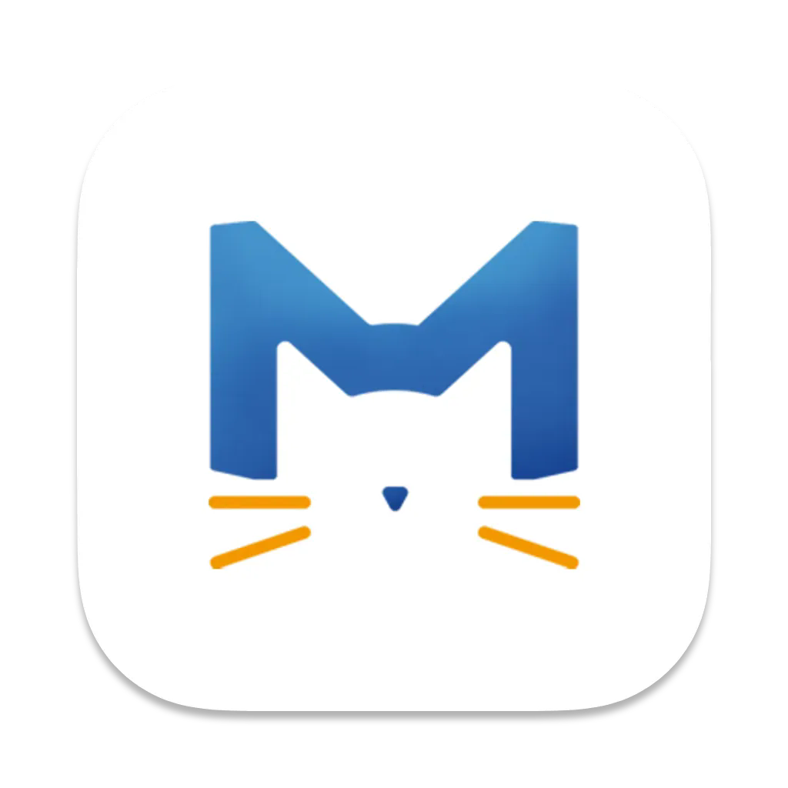&nbsp;
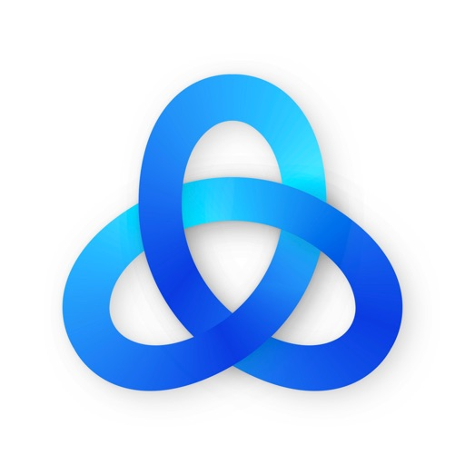&nbsp;

</p>

**Mac**：Surge Mac、Clash Verge、ClashMac、FlClash、Mihomo Party 等。

**移动端及其他客户端**：Shadowrocket、Surge、Stash、Loon、Quantumult X、Egern、sing-box、Hiddify、V2Box、Clash Mi、Karing 等。

按客户端能力提供一键导入、复制订阅或文件导出。[查看兼容说明](docs/CLIENT-COMPATIBILITY.md)

## 本机处理，自己掌控

订阅解析、规则匹配和配置生成都在本机完成，不经过第三方转换服务。iCloud 同步默认关闭，由你选择是否开启。

塔台不提供节点，也不建立代理连接；导出后请在对应客户端启用配置。

[隐私政策](docs/privacy.md) · [使用与支持](docs/support.md)

---

[开发指南](docs/DEVELOPMENT.md) · [架构](docs/ARCHITECTURE.md) · [发布流程](docs/RELEASING.md) · [贡献前必读](CLAUDE.md)

源码采用 [MIT](LICENSE) 许可。第三方资源按各自许可证分发，详见 [第三方声明](THIRD-PARTY-NOTICES.md)。
