<div align="center">

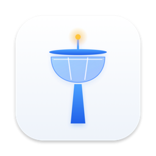

# 塔台 · Tower

**你的订阅，一处打理。**

在 iPhone、iPad 和 Mac 上管理机场订阅与自有节点，<br>
选好分流规则，一键导入你常用的客户端。

<a href="https://github.com/pengchujin/tower/releases/download/v1.0.26/Tower-1.0.26-65-macOS-universal.dmg"></a>
&nbsp;
<a href="https://apps.apple.com/app/id6797458927"></a>

[使用指南](https://tower.shenqi.uk) · [更新日志](https://github.com/pengchujin/tower/releases) · [反馈问题](https://github.com/pengchujin/tower/issues)

<br>

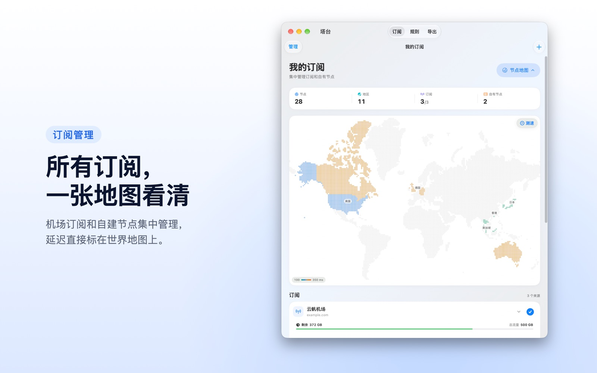

</div>

<br>

## 三步用起来

**添加订阅 → 选择规则 → 导出使用**

<table>
<tr>
<td width="33%">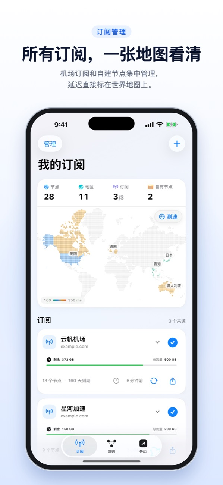</td>
<td width="33%">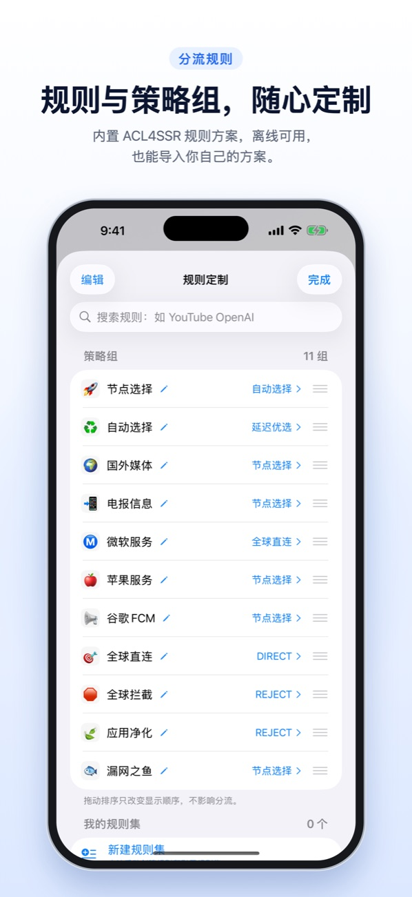</td>
<td width="33%">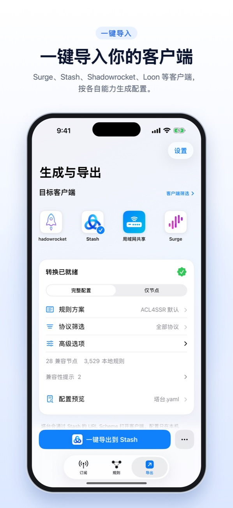</td>
</tr>
</table>

## 功能一览

<table>
<tr>
<td width="33%" valign="top">
<h3>集中管理</h3>
订阅、自有节点、流量信息和到期提醒放在一起，刷新时保留你取消勾选的节点。
</td>
<td width="33%" valign="top">
<h3>直观看节点</h3>
离线识别节点地区，也能手动标记；在世界地图上按延迟查看和测速。
</td>
<td width="33%" valign="top">
<h3>自由配规则</h3>
内置 ACL4SSR 规则，离线可用；可以导入自己的规则方案，定制策略组。
</td>
</tr>
<tr>
<td valign="top">
<h3>一键导入</h3>
按客户端能力提供一键导入、复制订阅或文件导出。
</td>
<td valign="top">
<h3>跨设备使用</h3>
Mac 专属布局、局域网共享，以及可选的 iCloud 同步。
</td>
<td valign="top">
<h3>连回家里</h3>
把 Tailscale 内网写进 Surge、Stash、Clash / mihomo 和 sing-box 配置，代理时也能访问家里电脑。
</td>
</tr>
</table>

## 支持你常用的客户端

<p>
&nbsp;
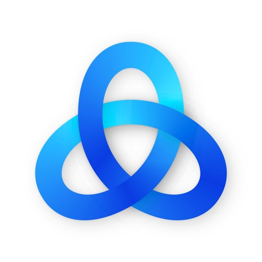&nbsp;
&nbsp;
&nbsp;
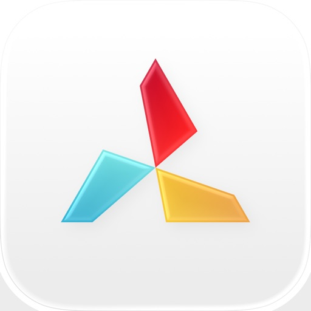&nbsp;
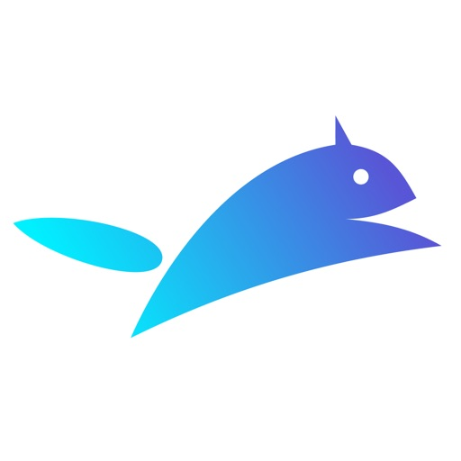&nbsp;
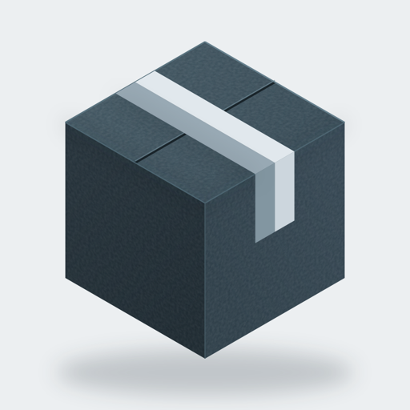&nbsp;
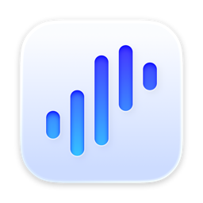&nbsp;
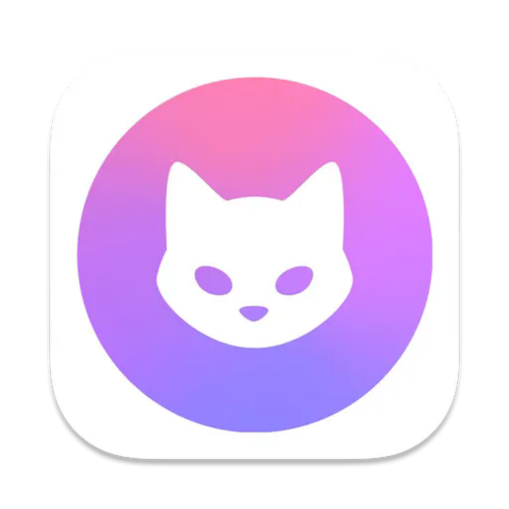&nbsp;
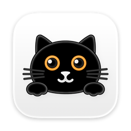&nbsp;
&nbsp;
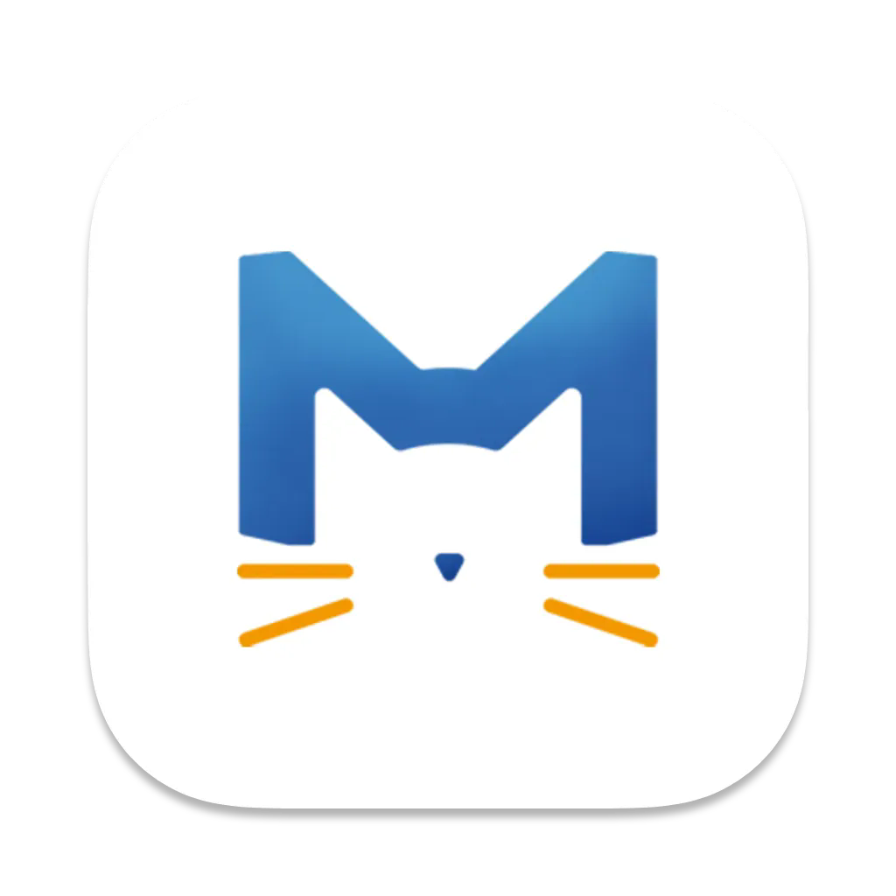
</p>

| 平台 | 客户端 |
| :-- | :-- |
| **Mac** | Surge Mac、Clash Verge、ClashMac、FlClash、Mihomo Party 等 |
| **移动端及其他** | Shadowrocket、Surge、Stash、Loon、Quantumult X、Egern、sing-box、Hiddify、V2Box、Clash、Anywhere、Clash Mi、Karing 等 |

Anywhere 支持仅节点订阅与本机一键导入，规则在 Anywhere 内设置。各客户端的导入方式和限制见 [兼容说明](docs/CLIENT-COMPATIBILITY.md)。

<p align="center">
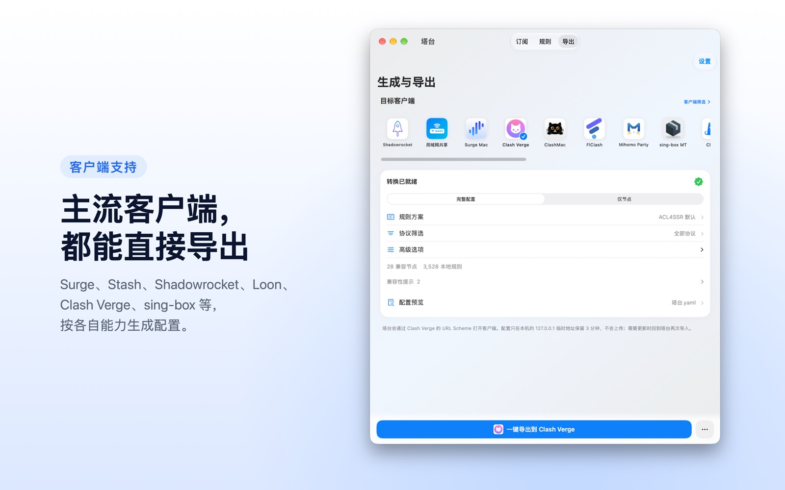
</p>

## 本机处理，自己掌控

<table>
<tr>
<td width="50%">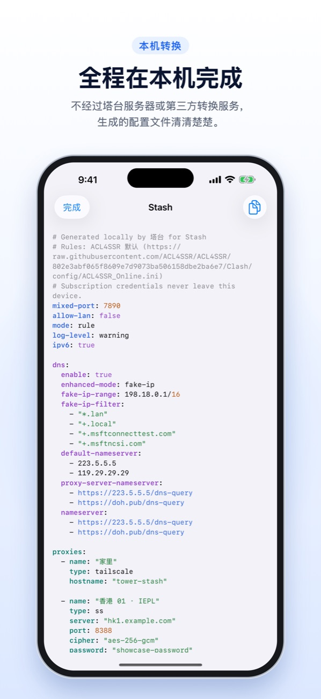</td>
<td width="50%">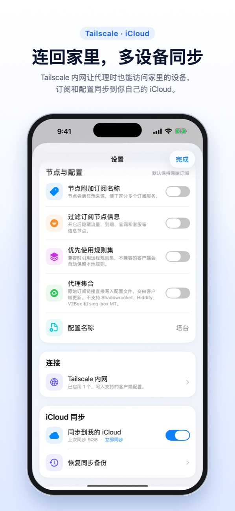</td>
</tr>
</table>

- 订阅解析、规则匹配和配置生成都在本机完成，不经过第三方转换服务。
- iCloud 同步默认关闭，由你选择是否开启。
- Tailscale Auth Key 只存在本机钥匙串，不参与同步。
- 塔台不提供节点，也不建立代理连接；导出后请在对应客户端启用配置。

[隐私政策](docs/privacy.md) · [使用与支持](docs/support.md)

## 下载与安装

| 平台 | 获取方式 |
| :-- | :-- |
| **iPhone / iPad** | [App Store](https://apps.apple.com/app/id6797458927) |
| **Mac** | [下载 DMG](https://github.com/pengchujin/tower/releases/download/v1.0.26/Tower-1.0.26-65-macOS-universal.dmg)，或使用 Homebrew |

```sh
brew install --cask pengchujin/tap/tower
```

---

<div align="center">

[开发指南](docs/DEVELOPMENT.md) · [架构](docs/ARCHITECTURE.md) · [发布流程](docs/RELEASING.md) · [贡献前必读](CLAUDE.md)

源码采用 [MIT](LICENSE) 许可。第三方资源按各自许可证分发，详见 [第三方声明](THIRD-PARTY-NOTICES.md)。

</div>
