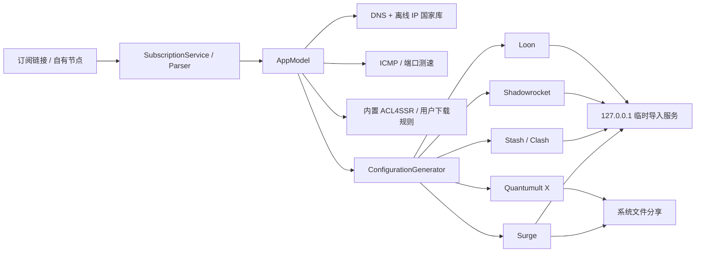

# 塔台技术架构

本文描述 2026-08-03 仓库快照的结构，供后续开发定位职责和回归风险。

## 1. 总览

塔台是一个本地优先的 SwiftUI iOS App。用户导入机场订阅或自有节点，App 在本机解析、识别地区、测速、套用本地规则，最后为七类客户端生成配置并交付。

## 2. App 生命周期与状态

### `Tower/TowerApp.swift`

- `TowerApp` 创建唯一的 `AppModel`。
- `AppRootView` 提供三个主标签：订阅、规则、导出。
- 全局 Toast 在根视图覆盖显示，避免每个页面重复管理。

### `Tower/AppModel.swift`

`@MainActor @Observable` 的中央状态容器，负责：

- 订阅、节点、规则、目标客户端和标签页选择。
- 拉取订阅、合并与去重节点、持久化快照。
- 触发 DNS/IP 国家识别和批量延迟测试。
- 缓存生成配置，缓存键包含目标、规则、节点和国家代码。
- 处理页面间跳转与用户提示。

网络、文件和解析工作下沉到 Service；UI 不应自行复制这些逻辑。增加状态时先判断它属于持久数据、运行期缓存还是纯页面状态，避免把瞬时动画状态写入 `AppModel`。

## 3. 领域模型

`Tower/Models/DomainModels.swift` 包含主要值类型：

- `SubscriptionSource`：订阅元数据、启用状态和更新时间。
- `ProxyNode` / `ProxyKind`：节点、协议和传输参数。
- `RulePreset` / `RulePolicy` / `RuleAssignment`：本地分流方案。
- `ClientTarget`：Surge、Stash/Clash、Shadowrocket、Loon、Quantumult X。
- `AppSnapshot`：持久化快照。
- `GeneratedConfiguration` / `ImportResult`：导出产物和导入结果。

默认选择随 App 提供的 ACL4SSR 方案。Self-Configuration 与其他远程方案统一走 `RuleScheme` 导入路径，只在用户明确操作时下载。

## 4. 订阅与节点解析

### `Tower/Services/SourceInputDetector.swift`

区分订阅 URL、单节点协议链接和不支持的粘贴内容，供“+”弹窗自动填充和提示使用。

### `Tower/Services/SubscriptionParser.swift`

- 通过 `URLSession` 拉取 HTTPS 订阅。
- 自定义 User-Agent 写入每个订阅/配额请求；可选 DoH 使用 Apple 公开的 `NWParameters.PrivacyContext` 与 `ResolverConfiguration.https`，请求由 actor 串行化并在结束后恢复默认解析设置。
- 解析普通文本、Base64 节点列表和 Clash YAML。
- 覆盖 SS、SSR、VMess、VLESS、Trojan、Hysteria、Hysteria 2、TUIC、WireGuard、AnyTLS、Snell、SOCKS5、HTTP(S)。WireGuard 只建模单 Peer，避免多 Peer YAML 被有损压平。
- 解析后标准化并去重。

机场经常添加私有字段。兼容新格式时要增加最小测试样本，避免放宽解析器后把提示页或 HTML 错当成订阅。

### `Tower/Services/ProxyShareService.swift`

生成节点协议链接、订阅分享内容和二维码数据。协议参数的编码顺序或缺省值修改需要与 Shadowrocket 等真机导入结果一起验证。

## 5. 国家识别、地球与测速

### `IPCountryDatabase.swift`

- 节点名称能明确表达国家/地区时优先使用名称。
- 名称无结果时，先检查服务器主机名，再通过系统 DNS 解析域名并查询随包离线 IPv4/IPv6 国家库。
- 不请求第三方 GeoIP API。

资源位于 `Tower/Resources/IPCountry/`。来源版本和许可记录在 `NOTICE.txt`。

### `NodeRegionResolver.swift`

名称优先：按国旗 Emoji、中英文国名/别名/城市、大写国家代码和主机名的顺序识别；这些都无结果时才使用离线 IP 国家库。这里统一维护国家代码、显示名、Emoji 和聚合地区，UI 与生成器不应各自维护一套映射。

### `NodeLatencyService.swift`

优先真实 ICMP Echo；网络或服务端不允许 ICMP 时退回节点端口连接耗时。界面必须显示实际测试类型。`AppModel` 以小批量并发，防止展开大量节点时阻塞主线程或瞬间创建过多任务。

### `Features/Subscriptions/NodeMapOverview.swift` 与 `WorldDotMapView.swift`

使用随 App 打包的 Natural Earth 点阵位图绘制平面世界地图，不依赖 MapKit。地图保留 `-180...180` 完整经度与 `-60...84` 纬度带，除不用于机场节点的南极洲外，国家表中的地区都必须使用真实坐标而不是被夹到边缘。节点按经纬度/地区聚合，标注保留国家/地区 Emoji；标签按选中状态、节点数和稳定 ID 排序，依次尝试近邻、对角与第二圈位置，低权重标签在无法避让时隐藏。修改布局后需在小屏、Dynamic Type、减少动态效果与深浅色模式下检查标注遮挡。

## 6. 规则资源与策略组

### `RuleSchemeRepository.swift`

读取包内 ACL4SSR 快照，并从 `RuleDownloadStore` 读取用户主动下载的方案。Self-Configuration 不随 App 打包；规则页底部的按钮下载其 Clash YAML 和规则提供者，删除方案时一并删除本地内容。

### 本地定制层

- `AppSnapshot.selectedRuleGroups` 只保存用户明确修改过的服务分组集合；缺少某个方案的键表示完整沿用上游，所以上游新增分组默认可见。
- `CustomRuleFlow` 与下载的 `RuleScheme` 分开持久化，通过 `schemeID` 关联。刷新上游只替换远程规则列表，不会覆盖 Tailscale 等用户规则。
- `RuleScheme.customized` 在生成前临时物化有效方案：筛掉未勾选服务规则、插入启用的自定义规则，再从规则流向反向闭包所有策略组依赖并保留 `FINAL`。
- 配置缓存键包含物化后方案的哈希；勾选分组或编辑自定义规则必须立即使旧导出失效。
- `AppSnapshot.preferRuleSets` 保存“优先使用规则集”设置，默认关闭。`preferRuleSetsWasExplicitlySet` 区分旧版曾经写入的隐式开启值与用户主动选择；旧数据升级后一律迁移为关闭，用户之后的手动选择仍会持久化。配置缓存键同时包含该开关，避免切换后复用另一种生成方式的文本。

### 策略层级约束

- 服务策略：国外广告、AI 服务、国外媒体、YouTube、Telegram、国际流量等。
- 基础选择：节点选择、手动切换、自动选择。
- 国家/地区策略：香港、日本、美国、新加坡、台湾、韩国、英国、德国、法国和其他地区。
- 地区策略自身使用延迟测试，从本地区节点自动选择最快节点。
- 服务策略可以引用基础选择和地区策略，地区策略不能反向引用服务策略，避免循环。
- 用户仍可在客户端中从服务策略手动选中某个国家/地区策略。

新增策略组时先画出引用方向，并用 `ConfigurationGeneratorTests` 验证没有自引用和环路。

## 7. 七种配置生成

### `Tower/Services/ConfigurationGenerator.swift`

一个生成入口，按 `ClientTarget` 输出：

- Surge：代理、策略组、本地规则。
- Stash/Clash：YAML proxies、proxy-groups、rules。
- Shadowrocket：节点、策略组和规则段。
- Loon：Proxy、Proxy Group 和 Rule。
- Quantumult X：server_local、policy 和 filter_local。
- Hiddify：sing-box JSON 出站、选择器和路由规则。
- Egern：YAML 节点、策略组和路由规则。

生成阶段还负责：

- 节点名去重和目标客户端转义。
- 跳过目标不支持的协议并把原因呈现在导出页。
- 保留策略名称中的语义 Emoji，不写远程策略组图标字段。
- 根据名称优先、离线 IP 回退的统一地区识别生成地区策略及其延迟优选子组。
- 将内置或用户下载的规则映射到各客户端语法。

### `Tower/Services/RuleSetEmissionPlanner.swift`

在生成前逐个远程资源检查已缓存内容的真实语法，而不是只看扩展名。设置页的“优先使用规则集”开启时：

- Clash/Stash 输出 `rule-providers` + `RULE-SET`；`payload:` 包装的 Clash Provider YAML 使用 `behavior: classical` + `format: yaml`。Surge/Shadowrocket 输出 URL `RULE-SET`，Loon 输出 `[Remote Rule]`，但三者遇到 Clash Provider YAML 时必须使用下载后的本地规则，不能直接引用其 URL。
- Quantumult X 仅在资源本身就是可用的 `filter_remote` 语法时远程引用；ACL4SSR 中不兼容的经典 Clash 规则仍本地转换。
- Hiddify/sing-box 仅引用含顶层 `rules` 的 sing-box source JSON；Egern 仅引用原生 rule-set YAML。
- 关闭开关，或任何一个资源的语法不兼容时，该资源自动回落为本地内联规则，不会生成客户端无法读取的远程引用。

这是风险最高的文件。任何修改都要运行完整测试，并抽查七种配置的语法、组引用和末尾兜底规则。

## 8. 导入与分享

### `DirectImportService.swift`

除 Quantumult X 外的目标客户端都可通过 Scheme 接收本地配置 URL，因此 App 临时启动 `NWListener`：

- 只绑定 `127.0.0.1`。
- URL 带随机 token。
- 45 秒自动关闭。
- 进入短暂后台时申请 background task，给目标客户端留出读取时间。
- 配置不上传互联网，也不作为远程订阅长期存活。

如果目标客户端未安装或 Scheme 打开失败，回退系统分享。Quantumult X 始终使用本地文件分享，因为公开 Scheme 不能完整导入本地配置。

### `LANSubscriptionServer.swift`

设置页的长期共享服务与 `DirectImportService` 的 45 秒 loopback 服务互相独立。它只在用户明确开启时绑定 Wi-Fi，路径必须携带本机生成并持久化的随机访问密钥。`/sub/<token>?target=auto` 与 `/download/<token>` 兼容 subconverter/Sub-Store 常见用法：显式 target 优先，否则从 User-Agent 识别 OpenClash/Clash、Surge、Shadowrocket、Loon、Quantumult X、Hiddify 或 Egern。未知 User-Agent 返回 400，不猜测格式。

服务每次请求都从 `AppModel.configuration(target:)` 读取当前本地快照，不转发机场请求，也不会把 `SubscriptionSource.urlString` 写进共享 URL、响应头或日志。这就是本项目的“订阅透传”边界：需要特定 UA/DoH 的上游仍由手机获取，LAN 客户端只看到脱离原始订阅凭据的生成结果。iOS 不能保证后台常驻，界面必须提示刷新期间保持 App 在前台。

### `ExportFileService.swift`

创建带正确扩展名和内容类型的临时配置文件，供系统分享使用。临时文件生命周期和清理不能早于分享控制器读取。

### `Features/Export/`

- `ExportView.swift`：横向目标客户端选择、摘要、预览、一键导入按钮。
- `ConfigurationTextView.swift`：基于 `UITextView` 显示大配置，避免 SwiftUI 大量文本布局造成峰值内存和闪退。

导出页曾出现完整预览闪退和切换卡顿，后续重构应避免在动画过程中重复生成整份配置或创建多个大字符串副本。

## 9. 持久化与隐私

### `PersistenceStore.swift`

- 将 `AppSnapshot` 保存到 Application Support 的 `state.json`。
- 文件使用完整数据保护。
- 订阅 URL 属于敏感数据，不能写入日志、分析事件或崩溃附加信息。

延迟和短期导入 URL 属于运行期状态，不需要持久化。日志中也不得打印完整节点链接、密码、UUID、订阅 token 或生成配置。

## 10. UI 目录

- `Features/Subscriptions/`：首页、添加来源、地球、分享。
- `Features/Rules/`：规则方案、策略说明和规则数量。
- `Features/Export/`：目标客户端、配置预览和导入。
- `Features/Settings/`：续费提醒、局域网订阅开关、目标格式、访问密钥和使用说明。
- `Design/`：主题与 UIKit/系统桥接组件。
- `Assets.xcassets`：只保存塔台自身 App 图标；目标客户端用品牌色与通用 SF Symbol 组合成塔台自绘矢量标识，不打包第三方 App Store 图标。

## 11. 测试

### 本地化

- `Tower/Localizable.xcstrings` 保存 15 种语言的界面、状态和错误文案，App 运行时不依赖翻译服务。
- `Tower/InfoPlist.xcstrings` 本地化 App 名称、相机用途和局域网用途说明。
- `AppLocalization` 从 `Bundle.main.preferredLocalizations` 读取用户为塔台单独选择的语言，并用对应 `Locale` 显示国家/地区名。
- 导入内容属于用户数据，订阅名、节点名和上游规则名不做翻译。
- `LocalizationTests` 检查目录完整性、关键人工校对文案和地区名称行为；维护脚本会校验格式化占位符没有被翻译破坏。

`TowerTests` 当前覆盖：

- 订阅、Base64、Clash YAML 和输入类型识别。
- 节点分享链接与展示字段。
- IP 国家库、地区回退和延迟服务。
- 规则预设迁移与首页交互模型。
- 七种配置生成、地区策略、图标及兼容跳过。
- HTTP/HTTPS 代理节点从链接或手动输入进入本地节点，并在七种客户端格式中均不被跳过。
- 一键导入 URL/Scheme 与导出呈现。
- 局域网订阅 token、target/User-Agent 路由、GET/HEAD、响应格式，以及通过真实回环 `NWListener`/`URLSession` 完成的端到端请求。
- 续费提醒授权、调度、关闭清理和敏感信息边界。
- 客户端顺序持久化、拖动升级兼容与矢量标识唯一性。
- 完整国家表坐标覆盖、地图投影和密集标签避让。

自动测试不能替代以下真机验收：客户端 Scheme 接收、系统分享目标、剪贴板权限、真实 ICMP、平面点阵地图标注、首次 Sheet 动画和超长配置预览。
