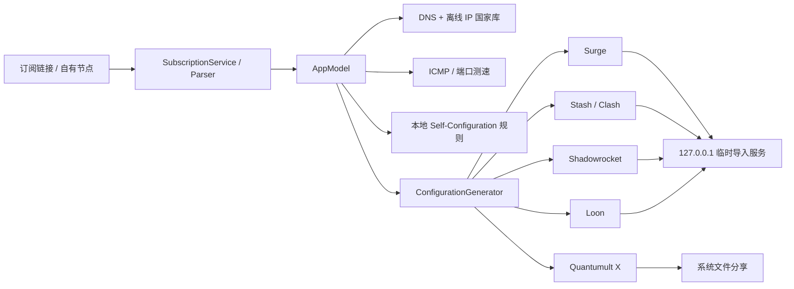

# 塔台技术架构

本文描述 2026-08-03 仓库快照的结构，供后续开发定位职责和回归风险。

## 1. 总览

塔台是一个本地优先的 SwiftUI iOS App。用户导入机场订阅或自有节点，App 在本机解析、识别地区、测速、套用本地规则，最后为五类客户端生成配置并交付。

## 2. App 生命周期与状态

### `Tower/TowerApp.swift`

- `TowerApp` 创建唯一的 `AppModel`。
- `AppRootView` 提供三个主标签：订阅、规则、导出。
- 全局 Toast 在根视图覆盖显示，避免每个页面重复管理。

### `Tower/AppModel.swift`

`@MainActor @Observable` 的中央状态容器，负责：

- 订阅、节点、规则、目标客户端和标签页选择。
- 拉取订阅、合并与去重节点、持久化快照。
- 触发 DNS/IP 国家识别和批量延迟测试。
- 缓存生成配置，缓存键包含目标、规则、节点和国家代码。
- 处理页面间跳转与用户提示。

网络、文件和解析工作下沉到 Service；UI 不应自行复制这些逻辑。增加状态时先判断它属于持久数据、运行期缓存还是纯页面状态，避免把瞬时动画状态写入 `AppModel`。

## 3. 领域模型

`Tower/Models/DomainModels.swift` 包含主要值类型：

- `SubscriptionSource`：订阅元数据、启用状态和更新时间。
- `ProxyNode` / `ProxyKind`：节点、协议和传输参数。
- `RulePreset` / `RulePolicy` / `RuleAssignment`：本地分流方案。
- `ClientTarget`：Surge、Stash/Clash、Shadowrocket、Loon、Quantumult X。
- `AppSnapshot`：持久化快照。
- `GeneratedConfiguration` / `ImportResult`：导出产物和导入结果。

目前默认且唯一的规则预设是 Self-Configuration。若将来支持多模板，先完善迁移和循环引用验证，不要直接复制现有策略组。

## 4. 订阅与节点解析

### `Tower/Services/SourceInputDetector.swift`

区分订阅 URL、单节点协议链接和不支持的粘贴内容，供“+”弹窗自动填充和提示使用。

### `Tower/Services/SubscriptionParser.swift`

- 通过 `URLSession` 拉取 HTTPS 订阅。
- 解析普通文本、Base64 节点列表和 Clash YAML。
- 覆盖 SS、SSR、VMess、VLESS、Trojan、Hysteria 2、SOCKS5、HTTP(S)。
- 解析后标准化并去重。

机场经常添加私有字段。兼容新格式时要增加最小测试样本，避免放宽解析器后把提示页或 HTML 错当成订阅。

### `Tower/Services/ProxyShareService.swift`

生成节点协议链接、订阅分享内容和二维码数据。协议参数的编码顺序或缺省值修改需要与 Shadowrocket 等真机导入结果一起验证。

## 5. 国家识别、地球与测速

### `IPCountryDatabase.swift`

- 域名先通过系统 DNS 解析。
- IPv4/IPv6 地址查询随包内置的紧凑二进制国家库。
- 不请求第三方 GeoIP API。

资源位于 `Tower/Resources/IPCountry/`。来源版本和许可记录在 `NOTICE.txt`。

### `NodeRegionResolver.swift`

优先使用 IP 查询结果；只有解析失败时才根据节点名识别。这里统一维护国家代码、显示名、Emoji 和聚合地区，UI 与生成器不应各自维护一套映射。

### `NodeLatencyService.swift`

优先真实 ICMP Echo；网络或服务端不允许 ICMP 时退回节点端口连接耗时。界面必须显示实际测试类型。`AppModel` 以小批量并发，防止展开大量节点时阻塞主线程或瞬间创建过多任务。

### `Features/Subscriptions/NodeGlobeView.swift`

使用 MapKit globe，相机保持圆形地球观感。节点按照经纬度/地区聚合并显示 Emoji。MapKit 样式、相机或标注改动需要在不同缩放级别和深浅色模式下检查遮挡。

## 6. 规则资源与策略组

### `RuleRepository.swift`

只读取包内 `.list` 快照，提供规则数量、来源与版本信息。规则资源位于 `Tower/Resources/SelfConfiguration/`，`manifest.json` 保存上游固定修订、文件哈希和数量。

### 策略层级约束

- 服务策略：国外广告、AI 服务、国外媒体、YouTube、Telegram、国际流量等。
- 基础选择：节点选择、手动切换、自动选择。
- 国家/地区策略：香港、日本、美国、新加坡、台湾、韩国、英国、德国、法国和其他地区。
- 地区策略自身使用延迟测试，从本地区节点自动选择最快节点。
- 服务策略可以引用基础选择和地区策略，地区策略不能反向引用服务策略，避免循环。
- 用户仍可在客户端中从服务策略手动选中某个国家/地区策略。

新增策略组时先画出引用方向，并用 `ConfigurationGeneratorTests` 验证没有自引用和环路。

## 7. 五种配置生成

### `Tower/Services/ConfigurationGenerator.swift`

一个生成入口，按 `ClientTarget` 输出：

- Surge：代理、策略组、本地规则。
- Stash/Clash：YAML proxies、proxy-groups、rules。
- Shadowrocket：节点、策略组和规则段。
- Loon：Proxy、Proxy Group 和 Rule。
- Quantumult X：server_local、policy 和 filter_local。

生成阶段还负责：

- 节点名去重和目标客户端转义。
- 跳过目标不支持的协议并把原因呈现在导出页。
- 为策略组添加客户端支持的图标字段。
- 根据 IP 国家识别生成地区策略及其延迟优选子组。
- 将 Self-Configuration 的本地规则映射到策略。

这是风险最高的文件。任何修改都要运行完整测试，并至少抽查五份配置的语法、组引用和末尾兜底规则。

## 8. 导入与分享

### `DirectImportService.swift`

Surge、Stash/Clash、Shadowrocket、Loon 的 Scheme 需要可读取 URL，因此 App 临时启动 `NWListener`：

- 只绑定 `127.0.0.1`。
- URL 带随机 token。
- 45 秒自动关闭。
- 进入短暂后台时申请 background task，给目标客户端留出读取时间。
- 配置不上传互联网，也不作为远程订阅长期存活。

如果目标客户端未安装或 Scheme 打开失败，回退系统分享。Quantumult X 始终使用本地文件分享，因为公开 Scheme 不能完整导入本地配置。

### `ExportFileService.swift`

创建带正确扩展名和内容类型的临时配置文件，供系统分享使用。临时文件生命周期和清理不能早于分享控制器读取。

### `Features/Export/`

- `ExportView.swift`：横向目标客户端选择、摘要、预览、一键导入按钮。
- `ConfigurationTextView.swift`：基于 `UITextView` 显示大配置，避免 SwiftUI 大量文本布局造成峰值内存和闪退。

导出页曾出现完整预览闪退和切换卡顿，后续重构应避免在动画过程中重复生成整份配置或创建多个大字符串副本。

## 9. 持久化与隐私

### `PersistenceStore.swift`

- 将 `AppSnapshot` 保存到 Application Support 的 `state.json`。
- 文件使用完整数据保护。
- 订阅 URL 属于敏感数据，不能写入日志、分析事件或崩溃附加信息。

延迟和短期导入 URL 属于运行期状态，不需要持久化。日志中也不得打印完整节点链接、密码、UUID、订阅 token 或生成配置。

## 10. UI 目录

- `Features/Subscriptions/`：首页、添加来源、地球、分享。
- `Features/Rules/`：规则方案、策略说明和规则数量。
- `Features/Export/`：目标客户端、配置预览和导入。
- `Design/`：主题与 UIKit/系统桥接组件。
- `Assets.xcassets`：App 图标及五个目标客户端图标。

## 11. 测试

`TowerTests` 当前覆盖：

- 订阅、Base64、Clash YAML 和输入类型识别。
- 节点分享链接与展示字段。
- IP 国家库、地区回退和延迟服务。
- 规则预设迁移与首页交互模型。
- 五种配置生成、地区策略、图标及兼容跳过。
- 一键导入 URL/Scheme 与导出呈现。

自动测试不能替代以下真机验收：客户端 Scheme 接收、系统分享目标、剪贴板权限、真实 ICMP、MapKit globe、首次 Sheet 动画和超长配置预览。
